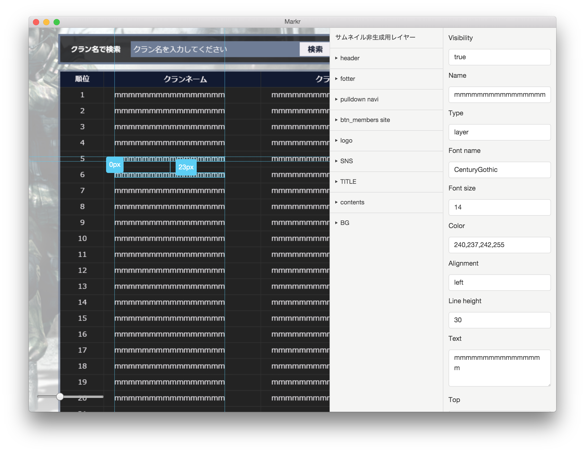

# Markr (Work in Progress)

Inspect `.psd` files like in Chrome DevTools

## Screenshot

 


## Dev

```
$ npm install
```

### Run

```
$ npm start
```

### Build

```
$ npm run build
```


## License

MIT © [Joshua Zhang](http://t39.me)
